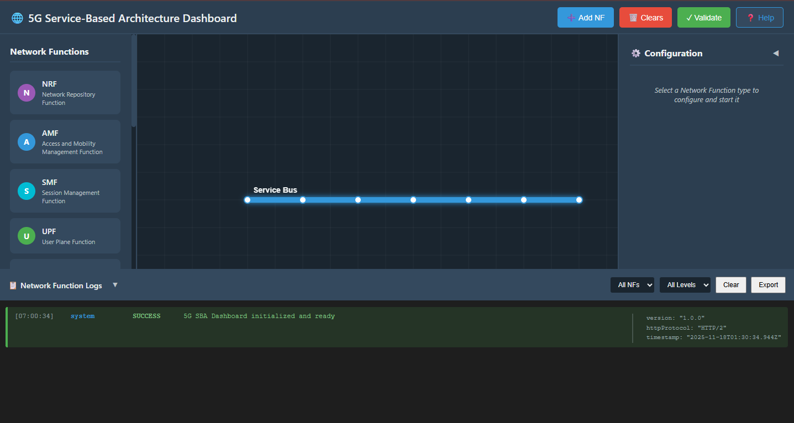
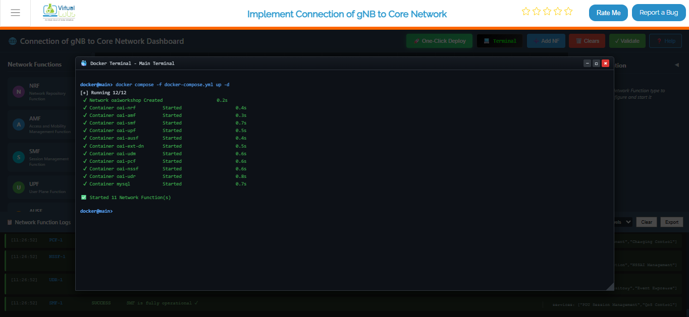
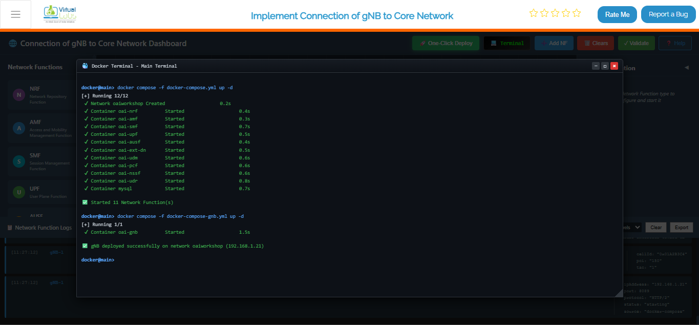
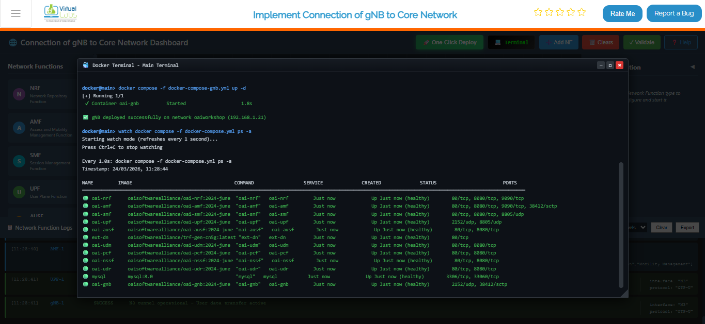
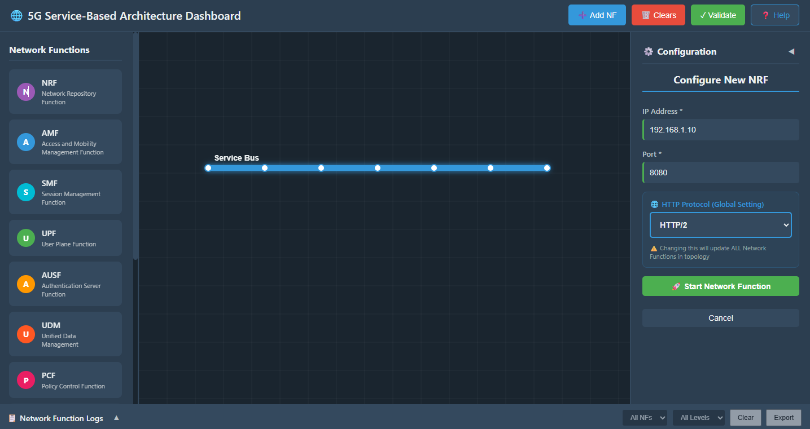
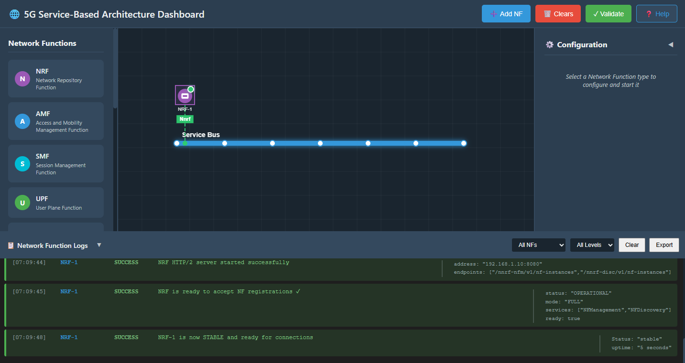
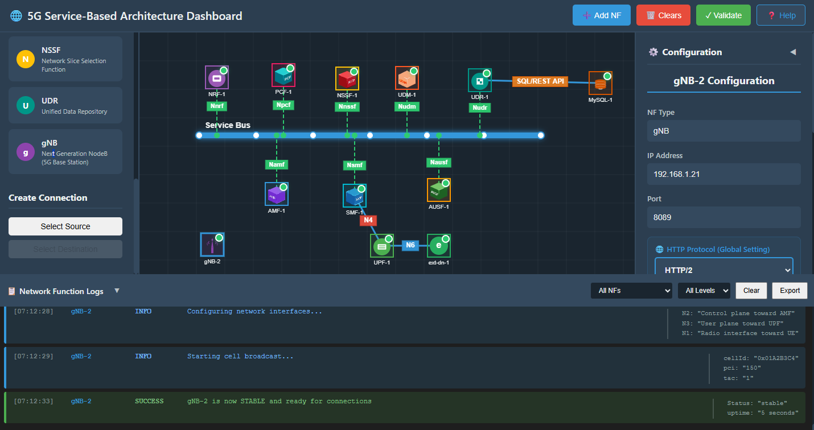
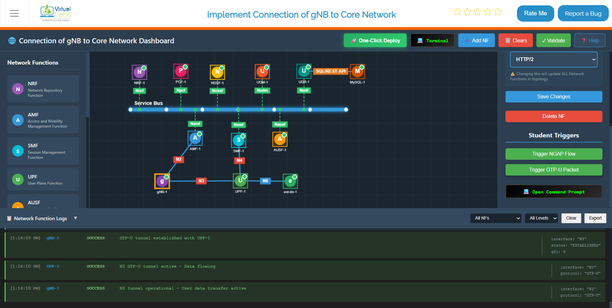
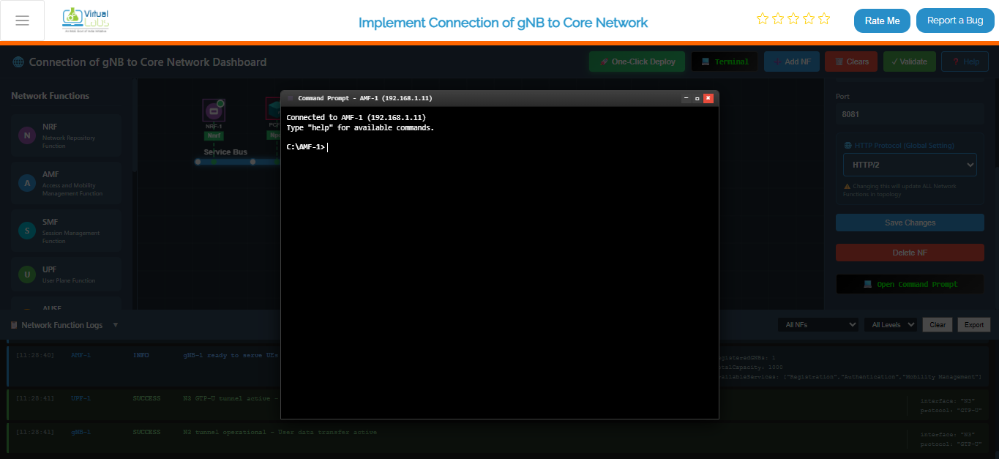
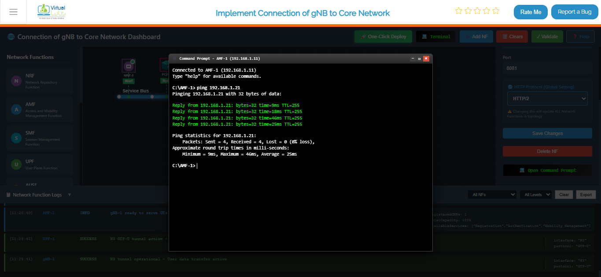

## Step 1: Initialize the Service-Based Architecture (SBA) Dashboard

### 1.1 Open the SBA Simulator Dashboard

Launch the SBA Simulator Dashboard. This is where all available 5G Core Network Functions (NFs) are visually represented and managed.

### 1.2 Verify Initialization

Once the dashboard loads, ensure that the following panels are visible:

- **NF List** (left or top)
- **Configuration Panel** (right side)
- **Logs Section** (bottom)
- **Command Terminal** (accessible under each NF)

Confirm that the UI is responsive and ready. If any panel is missing or the dashboard feels unresponsive, try refreshing the page before proceeding — it's better to catch that early than mid-deployment.

You are now ready to begin selecting and starting individual NFs.



*Fig: Service-Based Architecture (SBA) Dashboard*

---

## Step 2: Start Core Network Containers

### 2.1 Launch the Core Network
Click on the **Terminal** button to open the terminal, then from the project root directory execute:

```bash
docker compose -f docker-compose.yml up -d
```

This command starts all core network components — AMF, SMF, UPF, NRF, and more — in detached mode. The `-d` flag is important here: it runs everything in the background so your terminal doesn't get locked up. You'll get your prompt back immediately while all the containers quietly spin up behind the scenes.



*Fig: Terminal output showing core network deployment with docker compose*

### 2.2 Launch the gNB Services
Once the core network is up and running, deploy the gNB services:

```bash
docker compose -f docker-compose-gnb.yml up -d
```

This brings up the gNB (next-generation NodeB), which is the 5G radio access node. As soon as it's running, it reaches out to the core network and registers itself with the AMF. This is the handshake that connects the radio side to the core — without it, no UE can ever get through.



*Fig: Terminal output showing gNB deployment and registration with core network*

### 2.3 Monitor Container Status
To continuously monitor the status of the core network containers, use:

```bash
watch docker compose -f docker-compose.yml ps -a
```

This gives you a live, auto-refreshing view of all your core network containers. It's really useful right after deployment to watch everything settle into a healthy state. The `-a` flag makes sure you see all containers — including any that may have exited unexpectedly — so nothing slips past you.



*Fig: Live monitoring dashboard showing real-time status of all core network containers*

## Step 3: Configure and Start Network Functions (NFs)

### 3.1 Select an NF to Configure

From the NF List on the dashboard, click on the NF you want to deploy.

**Examples include:**
- AMF (Access and Mobility Management Function)
- SMF (Session Management Function)
- UPF (User Plane Function)
- NRF (Network Repository Function)

Clicking an NF opens its Configuration Panel on the right. Each NF has its own role in the network, so take a moment to make sure you're configuring the right one before filling in any details.



*Fig: Select NF and Open Configuration Panel*

### 3.2 Enter NF Configuration Details

In the configuration panel, enter the required fields:

**IP Address:**
- Provide a valid IPv4 address (e.g., 192.168.1.10)
- Make sure this IP is reachable within your network and doesn't conflict with other running NFs.

**Port Number:**
- Set the port on which the NF will run (e.g., 8080, 9090, etc.)
- Double-check that the port isn't already in use by another service — port conflicts are a common source of startup failures.

**Protocol:**
- Select either HTTP/1 or HTTP/2 depending on the NF behavior
- (Some NFs may auto-select based on internal configuration)
- HTTP/2 is generally preferred for 5G SBA interfaces as it supports multiplexing and is more efficient for service-to-service communication.

### 3.3 Start the NF

Click the **Start NF** button. The NF will begin starting up. You should see activity in the Logs Section almost immediately — that's a good sign things are moving.

### 3.4 Wait for NF Stabilization

Once initiated:
- The NF takes around 4-5 seconds to stabilize
- During this time, it registers itself with the NRF and establishes basic service readiness
- Avoid clicking Start again during this window — give it a moment to fully come up before assuming something went wrong.



*Fig: NF Stabilizing*

### 3.5 Verify NF Startup Logs

Scroll down to the **Logs Section**:

Successful startup messages include:
- "NF started successfully"
- "Service registration complete"
- "NF ready to accept connections"

These log lines confirm the NF is live and has registered itself on the service bus. If you see error messages instead, check the IP/port configuration — that's usually where things go wrong.

### 3.6 Repeat for All Remaining NFs

Follow the same steps for each NF in the 5G Core:
- AMF
- SMF
- UPF
- UDM
- AUSF
- NRF
- PCF
- Others as needed

A good rule of thumb: start with the NRF first, since other NFs register with it on startup. If the NRF isn't up yet, the rest may fail to register properly.

Make sure each NF:
- Starts correctly
- Stabilizes
- Appears in the logs as active

---

## Step 4: Start the gNB (Radio Access Node)

Once the core network is stabilized:

1. Select the gNB tile from the NF list
2. Provide a valid IP and other required details
3. Click **Start gNB**

Within 5 seconds, the gNB will become stable. It will establish the following connections:
- NGAP with AMF — this is the control plane link that handles UE registration and mobility
- GTP-U Tunnel with UPF — this is the user plane tunnel that carries actual data traffic

Both of these need to come up successfully before any UE can attach and pass traffic.



*Fig: gNB Initialization* 

 The gNB tile is selected from the NF list, IP and port details have been filled in, and the Start gNB button has been clicked. The status indicator shows the node coming online and beginning its startup sequence.


*Fig: Initiating NGAP Setup*

To trigger the NGAP flow, click the **Trigger NGAP Flow** button in the **Student Triggers** section of the Configuration Panel (right side). This initiates the NG Setup Request from the gNB to the AMF over the N2 interface. This is the control plane handshake that tells the core network the gNB is ready to serve UEs. A successful response from the AMF means the NGAP link is fully established.



*Fig: GTP-U Tunnel Established*

To establish the GTP-U tunnel, click the **Trigger GTP-U Packet** button in the **Student Triggers** section of the Configuration Panel (right side). This activates the GTP-U tunnel between the gNB and UPF over the N3 interface. This is the user plane path — all actual data traffic from UEs will flow through this tunnel. Once you see this confirmed in the logs, the gNB is fully operational and ready for UE attachment.

You can now:
- Check logs for NGAP/PDUSession messages
- Confirm tunnels are active
- Verify connectivity between gNB <-> UPF and gNB <-> AMF

---

## Step 5: Troubleshooting & Connectivity Validation

Test NF-to-NF connectivity by using the ping command through the terminal. This is a simple but effective way to confirm that your network functions can actually reach each other — not just that they started, but that they're genuinely talking.

### 5.1 Open NF Terminal

#### 5.1.1 Select the NF to Test

Click on the NF that will initiate the ping test (e.g., AMF). You're essentially stepping inside that container's network context to run the test from its perspective.

#### 5.1.2 Open Terminal

In the NF Configuration Panel, scroll down and click the **Open Command Prompt / Terminal** button.

A terminal window will appear displaying:
- NF Name
- IP Address
- Status



*Fig: NF Terminal Interface*

### 5.2 Perform Ping Test

#### 5.2.1 Enter the Ping Command

In the terminal's command input box, type:

```bash
ping <target_gNB_IP>
```

Replace `<target_gNB_IP>` with the actual IP address of the component you want to reach. For example:

```bash
ping 192.168.1.21
```

This sends ICMP echo requests from the selected NF to the target IP. It's the quickest way to rule out basic network reachability issues before diving into deeper troubleshooting.

#### 5.2.2 Send the Command

Click the **Send** button to execute the test. The terminal will submit the command and start displaying output within a second or two.



*Fig: Sending Ping Command in Terminal*

#### 5.2.3 Check Ping Output

The terminal output will show responses such as:

```
Reply from 192.168.1.11: bytes=32 time<1ms
Reply from 192.168.1.11: bytes=32 time=2ms
```

After four packets:
- **Packets Sent:** 4
- **Packets Received:** 4
- **Packet Loss:** 0%

Zero packet loss means the two components can reach each other cleanly. If you're seeing timeouts or high packet loss, double-check the IP addresses in your configuration and make sure both NFs are in the same network or the routing is set up correctly.

