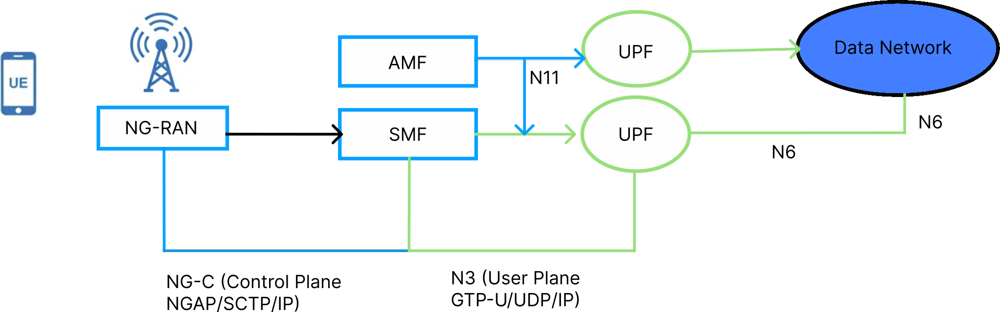
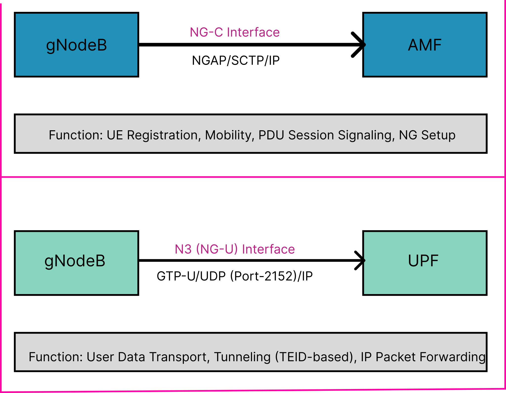
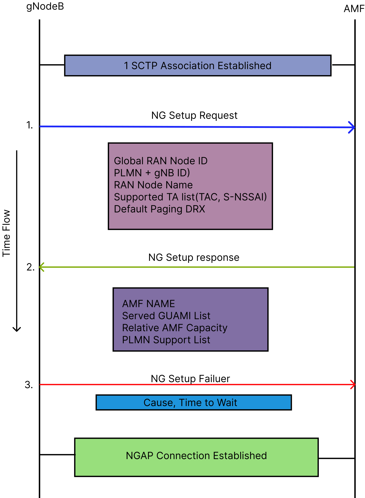
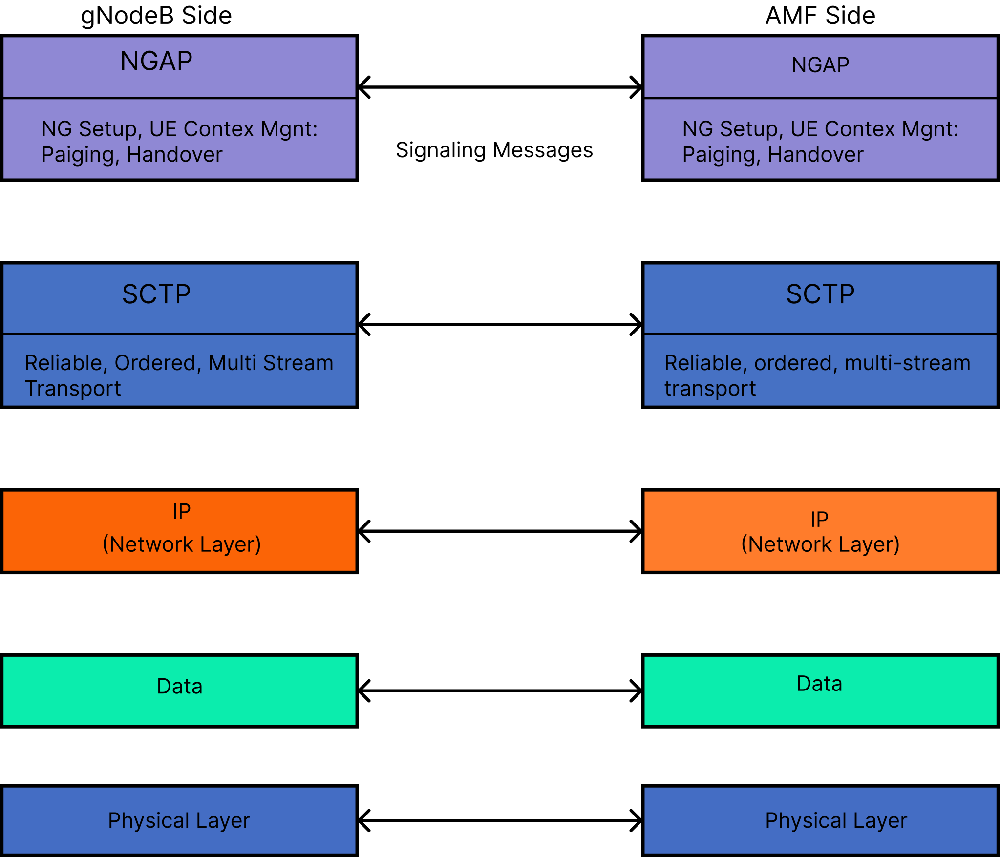
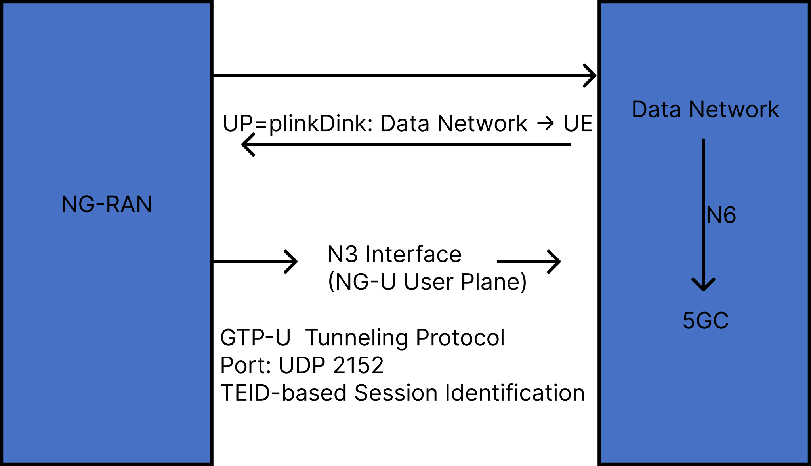
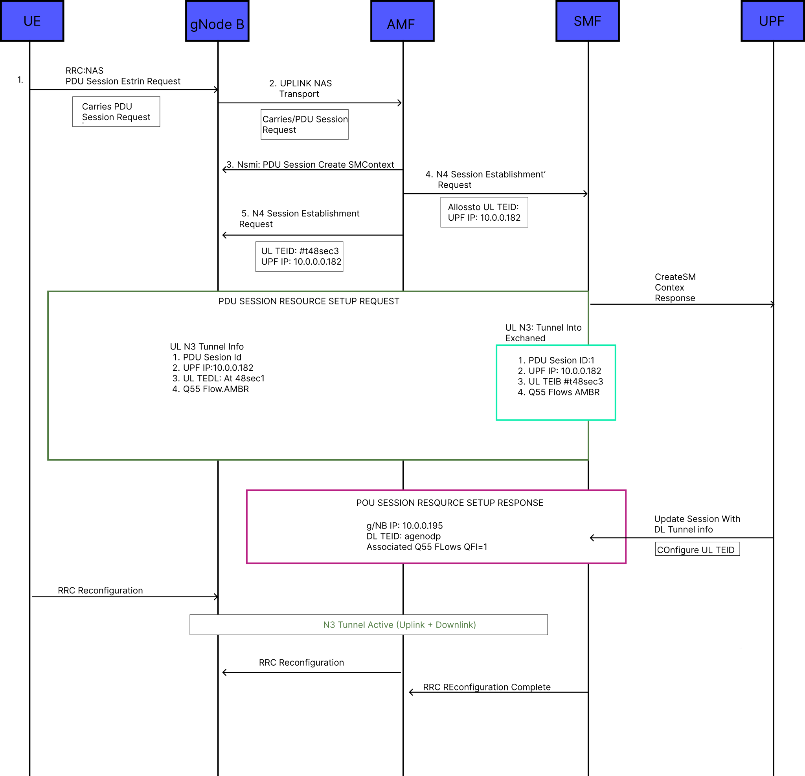
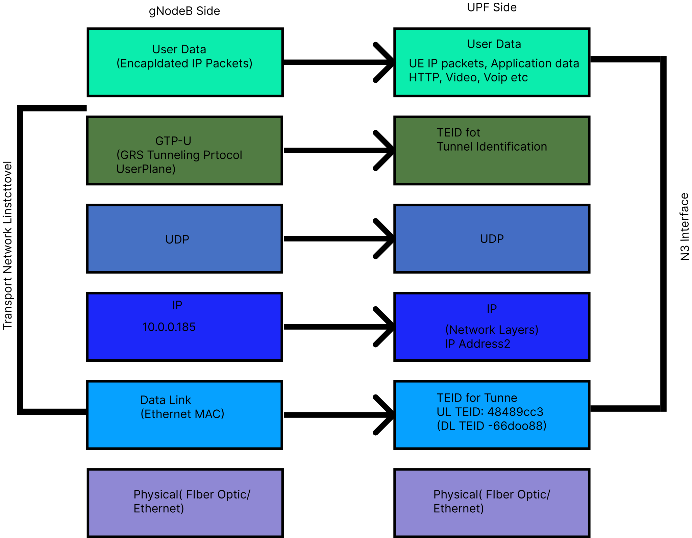
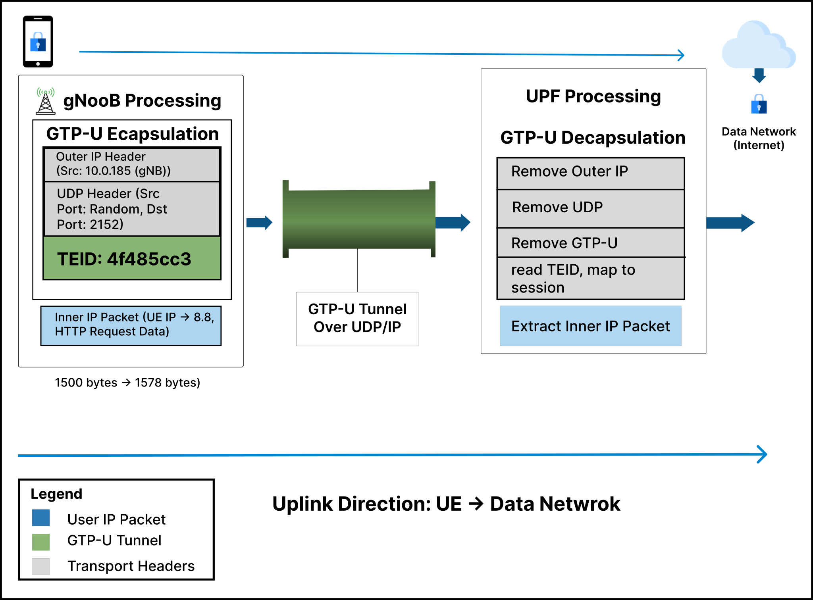
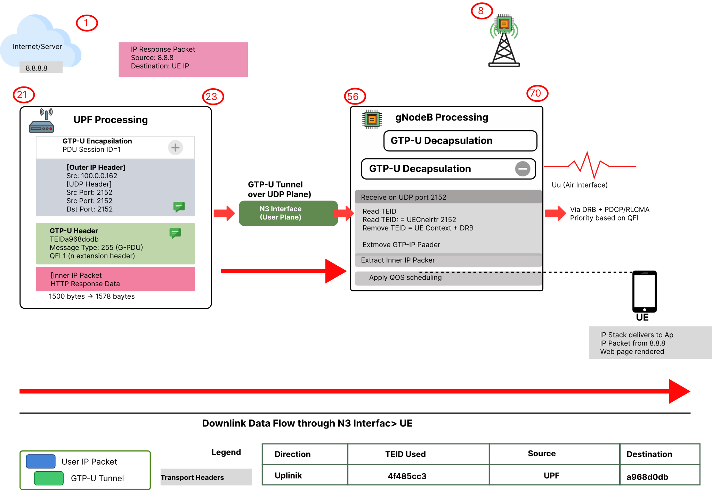
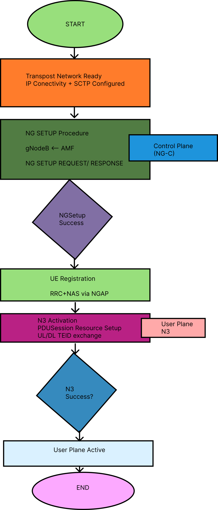

> **Audio Explanations:** For a more comprehensive understanding of these theoretical concepts, supplementary audio guides are available on YouTube.
> 
> - [**Listen in English**](https://youtu.be/CLBY6E7DMJo)
> - [**Listen in Hindi**](https://youtu.be/6Nb4IPH8EtA)

## 1. Introduction

The 5G New Radio (NR) system requires proper connectivity between the Radio Access Network (RAN) and the 5G Core Network (5GC). This experiment focuses on two fundamental procedures:

- **NG Setup Procedure**: Establishes the control plane connection between gNodeB (gNB) and Access and Mobility Management Function (AMF)
- **N3 Interface Activation**: Enables user plane data transmission between gNB and User Plane Function (UPF)

## 2. 5G System Architecture Overview

### 2.1 Network Components

**NG-RAN (Next Generation Radio Access Network):**
- gNodeB (gNB): Provides radio coverage and interfaces with 5G core

**5GC (5G Core Network):**
- AMF: Handles mobility and connection management
- UPF: Routes and forwards user data packets
- SMF: Manages PDU sessions

As illustrated in **Figure 1**, the high-level architecture of the 5G system establishes connectivity by linking the gNB in the RAN to the AMF, UPF, and SMF in the 5G Core. This diagram highlights the primary interfaces involved in managing both control and user plane traffic.

<div align="center">
  
</div>

*Figure 1: 5G System Architecture - NG Setup and N3 Interface*

### 2.2 NG Interface Components

**NG-C (NG Control Plane):**
- Connects gNB to AMF
- Uses NGAP (NG Application Protocol)
- Carries control/signaling messages

**NG-U / N3 (NG User Plane):**
- Connects gNB to UPF
- Uses GTP-U (GPRS Tunneling Protocol - User Plane)
- Carries actual user data

To better visualize these connections, **Figure 2** breaks down the NG interface into its two primary components: the NG-C (control plane) connecting the gNB to the AMF via NGAP, and the NG-U/N3 (user plane) establishing the path between the gNB and the UPF via GTP-U.

<div align="center">
  
</div>

*Figure 2: NG Interface Components*

## 3. NG Setup Procedure

### 3.1 Purpose

The NG Setup procedure is the first signaling exchange between gNB and AMF that establishes control plane connectivity.

- Exchange identities between gNB and AMF
- Share supported capabilities and network slices
- Verify service area compatibility
- Enable UE connection handling

### 3.2 NG Setup Message Flow

The initial signaling flow between the gNB and the AMF is demonstrated in **Figure 3**. The sequence outlines the step-by-step exchange required to establish control plane connectivity, starting from the underlying SCTP association to the successful setup of the NGAP connection.

<div align="center">
  
</div>

*Figure 3: NG Setup Procedure Sequence*

**Process Steps:**
- SCTP association established between gNB and AMF
- gNB sends NG SETUP REQUEST
- AMF validates the request
- AMF sends NG SETUP RESPONSE (or FAILURE)
- NGAP connection is active

### 3.3 NG Setup Request Message

**Key Information Elements:**

1. **Global RAN Node ID**
   - PLMN Identity: MCC + MNC (e.g., '00F110'H for MCC=001, MNC=01)
   - gNB ID: Unique identifier (e.g., '0012345'H)

2. **Supported TA List**
   - TAC (Tracking Area Code): e.g., '000064'H (TAC=100)
   - Broadcast PLMN List
   - TAI Slice Support List (S-NSSAI with SST)
     - SST (Slice/Service Type): e.g., '01'H for eMBB

3. **Default Paging DRX**
   - Values: v32, v64, v128, v256 (radio frames)
   - Example: v128 = check paging every 1.28 seconds

4. **RAN Node Name**
   - Human-readable identifier (e.g., "gnb0012345")

**Example:**

```
NG SETUP REQUEST
{
    Global RAN Node ID:
    {
        PLMN Identity: 00101
        gNB ID: 0012345
    }
    
    Supported TA List:
    {
        TAC: 000064
        S-NSSAI: { SST: 01 }
    }
    
    Default Paging DRX: v128
}
```

### 3.4 NG Setup Response Message

**Key Information Elements:**

1. **AMF Name**
   - FQDN format: "amarisoft.amf.5gc.mnc001.mcc001.3gppnetwork.org"

2. **Served GUAMI List**
   - GUAMI components:
     - PLMN Identity
     - AMF Region ID: e.g., '80'H (128 decimal)
     - AMF Set ID: e.g., 4
     - AMF Pointer: e.g., 1

3. **Relative AMF Capacity**
   - Value: 0-255 (higher = greater capacity)
   - Used for load balancing

4. **PLMN Support List**
   - Supported PLMNs and network slices
   - Must overlap with gNB's capabilities

**Example:**

```
NG SETUP RESPONSE
{
    AMF Name: "amarisoft.amf.5gc.mnc001.mcc001.3gppnetwork.org"
    
    Served GUAMI List:
    {
        PLMN Identity: 00101
        AMF Region ID: 128
        AMF Set ID: 4
        AMF Pointer: 1
    }
    
    Relative AMF Capacity: 50
    
    PLMN Support List:
    {
        PLMN Identity: 00F110
        S-NSSAI: { SST: 01 }
    }
}
```

### 3.5 NGAP Protocol Stack

**Figure 4** details the protocol stack used for NG-C signaling. As shown, NGAP serves as the application layer operating over SCTP, which provides reliable transport on top of standard IP and Ethernet network layers.

<div align="center">
  
</div>

*Figure 4: NGAP Protocol Stack*

**Layers:**
- **NGAP**: Application layer for NG-C signaling
- **SCTP**: Reliable transport (Port 38412)
- **IP**: Network layer routing
- **Ethernet**: Physical connectivity

## 4. N3 Interface and Activation

### 4.1 N3 Interface Overview

The N3 interface is the user plane interface between gNB and UPF.

**Purpose:**
- Carries user data between UE and Data Networks
- Uses GTP-U tunneling protocol
- Operates independently of control plane

**Key Characteristics:**
- Tunnel-based using TEIDs (Tunnel Endpoint Identifiers)
- Bidirectional (uplink and downlink)
- Separate tunnel for each PDU session

**Figure 5** highlights the position of the N3 interface within the overall 5G network topology. As depicted, the N3 tunnel acts as the dedicated user plane path directly linking the gNB to the UPF, bypassing the control plane nodes.

<div align="center">
  
</div>

*Figure 5: N3 Interface Position in 5G Network*

### 4.2 N3 Activation Through PDU Session Setup

The N3 activation process occurs seamlessly during the PDU Session Resource Setup. **Figure 6** outlines the required signaling flow, demonstrating how this procedure successfully configures the necessary GTP-U tunnels for user data transmission between the gNB and UPF.

<div align="center">
  
</div>

*Figure 6: N3 Activation via PDU Session Setup*

### 4.3 PDU Session Resource Setup Request

**Key Information Elements:**

1. **PDU Session ID**
   - Unique identifier (0-255), e.g., PDU Session ID = 1

2. **S-NSSAI**
   - Network slice identifier (SST: '01'H)

3. **UL NG-U UP TNL Information**
   - UPF IP Address: e.g., 10.0.0.162
   - Uplink TEID: e.g., 4f485cc3
   - gNB uses these to send uplink data to UPF

4. **PDU Session Type**
   - IPv4, IPv6, or Ethernet

5. **QoS Flow Setup Request List**
   - QFI (QoS Flow Identifier): e.g., 1
   - 5QI: e.g., 9 (default bearer)

**Example:**

```
PDU SESSION RESOURCE SETUP REQUEST
{
    PDU Session ID: 1
    S-NSSAI: { SST: 01 }
    
    UL NG-U UP TNL Information:       ← N3 UPLINK TUNNEL
    {
        Transport Layer Address: 10.0.0.162  (UPF IP)
        GTP-TEID: 4f485cc3                   (UL TEID)
    }
    
    PDU Session Type: IPv4
    
    QoS Flow: { QFI: 1, 5QI: 9 }
}
```

### 4.4 PDU Session Resource Setup Response

**Key Information Elements:**

1. **DL QoS Flow Per TNL Information**
   - gNB IP Address: e.g., 10.0.0.185
   - Downlink TEID: e.g., a968d0db
   - UPF uses these to send downlink data to gNB

2. **Associated QoS Flow List**
   - Successfully established flows (e.g., QFI=1)

**Example:**

```
PDU SESSION RESOURCE SETUP RESPONSE
{
    PDU Session ID: 1
    
    DL QoS Flow Per TNL Information:   ← N3 DOWNLINK TUNNEL
    {
        Transport Layer Address: 10.0.0.185  (gNB IP)
        GTP-TEID: a968d0db                   (DL TEID)
    }
    
    Associated QoS Flow List: { QFI: 1 }
}
```

**Result:** N3 tunnel is now fully configured for bidirectional data flow.

### 4.5 N3 Protocol Stack

To understand how data is transported across the core network, **Figure 7** depicts the protocol stack for the N3 user plane interface. It illustrates how original user IP packets are encapsulated within GTP-U and UDP headers before physical transmission.

<div align="center">
  
</div>

*Figure 7: N3 Interface Protocol Stack*

**Layers:**
- **User Data**: User IP packets
- **GTP-U**: Tunneling protocol with TEID
- **UDP**: Port 2152
- **IP**: Source/Destination addressing
- **Ethernet**: Physical transport

### 4.6 N3 Data Flow

#### 4.6.1 Uplink Flow (UE → Data Network)

**Figure 8** traces the path of an uplink data packet originating from the UE. The diagram visualizes the encapsulation process that occurs at the gNB, as well as the subsequent decapsulation at the UPF before the packet finally reaches the external Data Network.

<div align="center">
  
</div>

*Figure 8: Uplink Data Flow Through N3*

**Steps:**
1. UE sends IP packet (e.g., to 8.8.8.8)
2. gNB receives on radio interface
3. gNB encapsulates with GTP-U:
   - [Outer IP: gNB (10.0.0.185) → UPF (10.0.0.162)]
   - [UDP: Port 2152]
   - [GTP-U Header: UL TEID = 4f485cc3]
   - [Inner IP Packet: UE → 8.8.8.8]
4. Packet transmitted over N3 interface
5. UPF decapsulates (removes outer headers)
6. UPF forwards to Data Network

#### 4.6.2 Downlink Flow (Data Network → UE)

In the reverse direction, **Figure 9** illustrates the path for downlink data. It details how the UPF encapsulates incoming packets arriving from the Data Network, forwarding them via the established N3 tunnel to the gNB for final delivery over the radio interface to the UE.

<div align="center">
  
</div>

*Figure 9: Downlink Data Flow Through N3*

**Steps:**
1. Data Network sends response (e.g., from 8.8.8.8)
2. UPF receives packet
3. UPF encapsulates with GTP-U:
   - [Outer IP: UPF (10.0.0.162) → gNB (10.0.0.185)]
   - [UDP: Port 2152]
   - [GTP-U Header: DL TEID = a968d0db]
   - [Inner IP Packet: 8.8.8.8 → UE]
4. Packet transmitted over N3 interface
5. gNB decapsulates (removes outer headers)
6. gNB forwards to UE over radio

**Key Fields:**
- **Version**: 001 (GTP version 1)
- **Message Type**: 255 for user data (G-PDU)
- **TEID (32 bits)**: Most critical field
  - Uplink: UL TEID assigned by UPF
  - Downlink: DL TEID assigned by gNB
  - Used to identify PDU session


## 5. Relationship Between NG Setup and N3

### 5.1 Dependency

**Figure 10** clarifies the critical dependency between the control plane and user plane setup processes. It emphasizes a fundamental rule of 5G architecture: the NG Setup (control plane) must be fully and successfully established before the N3 interface (user plane) can be activated.

<div align="center">
  
</div>

*Figure 10: NG Setup to N3 Activation Flow*

**Key Points:**
- NG Setup is prerequisite: Must complete before N3 can be activated
- Different protocols: NG Setup uses NGAP, N3 uses GTP-U
- Different endpoints: NG Setup (gNB-AMF), N3 (gNB-UPF)
- One-to-many: One NG Setup supports multiple N3 tunnels

### 5.2 Complete Call Flow

1. **Network Setup Phase**
   - Physical connectivity established
   - SCTP association created
   - NG Setup Request/Response exchanged
   - NG-C interface ready

2. **UE Attachment Phase**
   - UE registration via NGAP
   - Authentication and security

3. **N3 Activation Phase**
   - PDU Session requested
   - Setup Request with UL tunnel info (UPF IP, UL TEID)
   - Setup Response with DL tunnel info (gNB IP, DL TEID)
   - N3 tunnels active

4. **Data Communication**
   - User data flows: UE ↔ gNB ↔ N3 ↔ UPF ↔ Data Network

## 6. Summary

### 6.1 NG Setup

**Purpose:** Establish control plane connectivity (gNB ↔ AMF)

**Key Messages:**
- NG Setup Request: Global RAN Node ID, Supported TAs, Paging DRX
- NG Setup Response: AMF Name, GUAMI List, PLMN Support List

**Protocol:** NGAP/SCTP/IP (Port 38412)

### 6.2 N3 Interface

**Purpose:** Carry user plane data (gNB ↔ UPF)

**Activation:** PDU Session Resource Setup procedure

**Key Parameters:**
- Request: UPF IP + Uplink TEID
- Response: gNB IP + Downlink TEID

**Protocol:** GTP-U/UDP/IP (Port 2152)

### 6.3 Importance

- **NG Setup**: Foundation for all signaling; enables UE connection
- **N3 Interface**: Carries actual user traffic; impacts user experience
- **Together**: Enable complete 5G connectivity (control + data)

## 7. Sample Configuration Details
 
Real deployments require gNB and AMF configuration files that define the parameters exchanged during NG Setup and N3 activation. Below are representative configuration snippets (Amarisoft/open5gs-style) illustrating how the Information Elements from Sections 3 and 4 map to actual config entries.
 
### 7.1 gNB Configuration (relevant to NG Setup)
 
```yaml
# gnb.yaml (excerpt)
gnb_id: 0x0012345          # Global RAN Node ID -> gNB ID
gnb_id_bits: 28
 
plmn_list:
  - plmn: "00101"           # MCC=001, MNC=01
    tac: 100                # Tracking Area Code (decimal for TAC 000064H)
    reserved: false
 
slicing:
  - sst: 1                  # S-NSSAI SST for eMBB, matches TAI Slice Support List
    sd: null
 
amf_list:
  - addr: 10.0.0.10          # AMF IP address for SCTP association
    port: 38412               # NGAP/SCTP port
    bind_addr: 10.0.0.185     # gNB local bind address
 
paging_drx: 128              # Default Paging DRX (v128)
 
ran_node_name: "gnb0012345"  # RAN Node Name IE
```
 
### 7.2 AMF Configuration (relevant to NG Setup Response)
 
```yaml
# amf.yaml (excerpt)
amf_name: "amarisoft.amf.5gc.mnc001.mcc001.3gppnetwork.org"
 
guami:
  plmn_id: "00101"
  amf_region_id: 128         # 0x80
  amf_set_id: 4
  amf_pointer: 1
 
relative_capacity: 50        # Relative AMF Capacity (load balancing)
 
plmn_support_list:
  - plmn_id: "00101"
    s_nssai:
      - sst: 1
 
ngap:
  bind_addr: 10.0.0.10
  port: 38412
```
 
### 7.3 SMF/UPF Configuration (relevant to N3 Activation)
 
```yaml
# upf.yaml (excerpt)
n3_interface:
  addr: 10.0.0.162            # UPF IP used in UL NG-U UP TNL Information
  gtpu_port: 2152
 
pdu_session_defaults:
  pdu_session_type: IPv4
  qos:
    qfi: 1
    five_qi: 9                # Default bearer 5QI
 
teid_pool:
  ul_teid_range: "0x40000000-0x4FFFFFFF"   # Example: 4f485cc3 falls in this range
  dl_teid_range: "0xA0000000-0xAFFFFFFF"   # Example: a968d0db falls in this range
```
 
**Mapping to earlier sections:** the `plmn_list`/`slicing` entries in the gNB config directly populate the NG SETUP REQUEST's *Global RAN Node ID* and *Supported TA List*; the AMF's `guami`/`relative_capacity` entries populate the NG SETUP RESPONSE; and the UPF's `n3_interface`/`teid_pool` values are what get returned as *Transport Layer Address* and *GTP-TEID* in the PDU Session Resource Setup exchange (Section 4.3–4.4).
 
## 8. NAS Signaling Overview
 
### 8.1 What is NAS?
 
**NAS (Non-Access Stratum)** is the signaling layer between the **UE and AMF** that handles mobility and session-related procedures — as distinct from **AS (Access Stratum)** signaling, which operates between the UE and the RAN (gNB).
 
Unlike NGAP, which is a gNB–AMF protocol, NAS messages are generated by the UE and AMF and are simply **carried transparently through the gNB** inside NGAP containers. The gNB does not interpret NAS content; it only relays it.
 
### 8.2 Relationship to NG Setup and N3
 
- **NG Setup** must complete first — it establishes the NGAP/SCTP transport over which NAS messages can be carried between gNB and AMF.
- Once NG-C is up, the UE's NAS messages (e.g., Registration Request) are encapsulated inside NGAP **Initial UE Message** / **Uplink NAS Transport** procedures and forwarded by the gNB to the AMF.
- **N3 activation** (Section 4) is itself triggered by a NAS-level procedure: the PDU Session Establishment Request is a NAS message from UE to SMF (via AMF), and the resulting **PDU Session Resource Setup** exchange over NGAP is what actually configures the N3 GTP-U tunnel.

### 8.3 Key NAS Procedures
 
- **Registration Management (5GMM)**
  - Registration Request / Accept / Reject
  - De-registration
- **Session Management (5GSM)**
  - PDU Session Establishment Request / Accept / Reject (see the Session Management document, Section 4)
  - PDU Session Modification / Release
- **Authentication and Security**
  - Authentication Request/Response (5G-AKA)
  - Security Mode Command/Complete
  
### 8.4 NAS Transport Example
 
```
NGAP: INITIAL UE MESSAGE
{
    RAN UE NGAP ID: 1
    NAS-PDU: <encrypted NAS Registration Request>
    User Location Information: { TAC: 000064, PLMN: 00101 }
}
```
 
The `NAS-PDU` field is opaque to the gNB — it is decoded only by the AMF (and, for security-protected messages, decrypted after the Security Mode procedure completes). This separation of AS (NGAP, radio) and NAS (UE↔AMF/SMF) signaling is what allows the gNB to remain a relatively simple relay point while all mobility and session intelligence stays in the 5G Core.