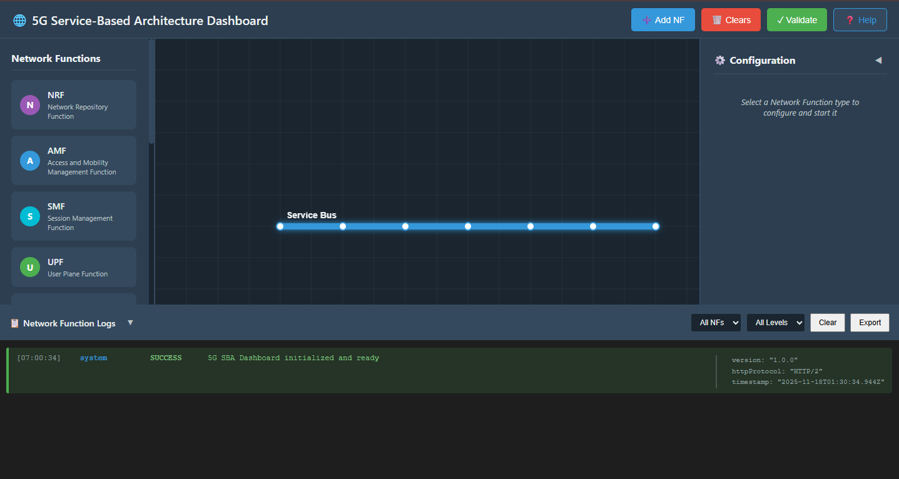
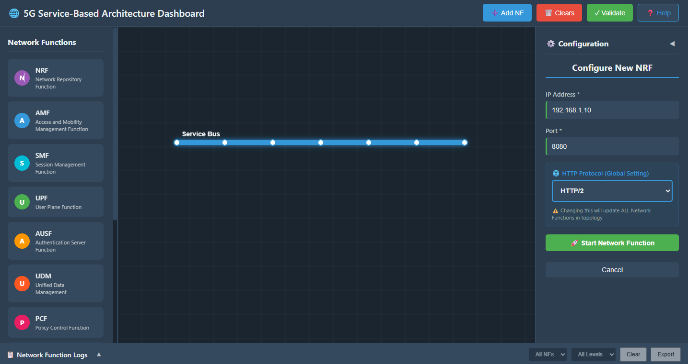
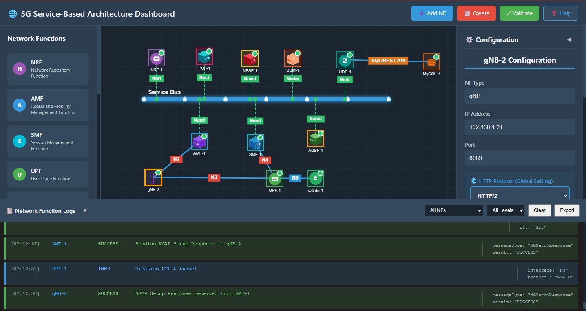
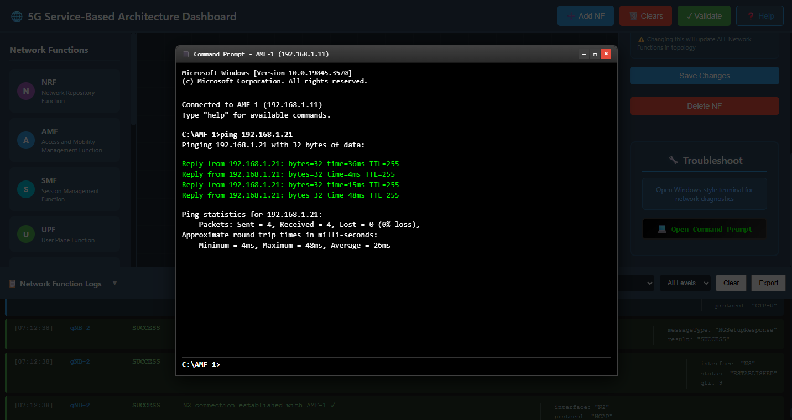

## Step 1: Initialize the Service-Based Architecture (SBA) Dashboard

### 1.1 Open the SBA Simulator Dashboard

Launch the SBA Simulator Dashboard. This is where all available 5G Core Network Functions (NFs) are visually represented and managed.

### 1.2 Verify Initialization

Once the dashboard loads, ensure that the following panels are visible:

- **NF List** (left or top)
- **Configuration Panel** (right side)
- **Logs Section** (bottom)
- **Command Terminal** (accessible under each NF)

Confirm that the UI is responsive and ready.

You are now ready to begin selecting and starting individual NFs.



**Figure 1:** Service-Based Architecture (SBA) Dashboard

---

## Step 2: Start Core Network Containers

### 2.1 Launch the Core Network
Click on the **Terminal** button to open the terminal, then from the project root directory execute:

This command starts all core network components (AMF, SMF, UPF, NRF, etc.) in detached mode.

```bash
docker compose -f docker-compose.yml up -d
```


### 2.2 Launch the gNB Services
Once the core network is up and running, deploy the gNB services:

```bash
docker compose -f docker-compose-gnb.yml up -d
```
This command initializes the gNB and establishes connectivity with the core network.


### 2.3 Monitor Container Status
To continuously monitor the status of the core network containers, use:

```bash
watch docker compose -f docker-compose.yml ps -a
```


## Step 3: Configure and Start Network Functions (NFs)

### 3.1 Select an NF to Configure

From the NF List on the dashboard, click on the NF you want to deploy.

**Examples include:**
- AMF (Access and Mobility Management Function)
- SMF (Session Management Function)
- UPF (User Plane Function)
- NRF (Network Repository Function)

Clicking an NF opens its Configuration Panel on the right.



**Figure 2:** Select NF and Open Configuration Panel

### 3.2 Enter NF Configuration Details

In the configuration panel, enter the required fields:

**IP Address:**
- Provide a valid IPv4 address (e.g., 192.168.1.10)

**Port Number:**
- Set the port on which the NF will run (e.g., 8080, 9090, etc.)

**Protocol:**
- Select either HTTP/1 or HTTP/2 depending on the NF behavior
- (Some NFs may auto-select based on internal configuration)

### 3.3 Start the NF

Click the **Start NF** button. The NF will begin starting up.

### 3.4 Wait for NF Stabilization

Once initiated:
- The NF takes around 4-5 seconds to stabilize
- During this time, it registers itself and establishes basic service readiness


**Figure 3:** NF Stabilizing

### 3.5 Verify NF Startup Logs

Scroll down to the **Logs Section**:

Successful startup messages include:
- "NF started successfully"
- "Service registration complete"
- "NF ready to accept connections"

This indicates the function is live and communicating (if any peer NFs are up).

### 3.6 Repeat for All Remaining NFs

Follow the same steps for each NF in the 5G Core:
- AMF
- SMF
- UPF
- UDM
- AUSF
- NRF
- PCF
- Others as needed

Make sure each NF:
- Starts correctly
- Stabilizes
- Appears in the logs as active

---

## Step 4: Start the gNB (Radio Access Node)

Once the core network is stabilized:

1. Select the gNB tile from the NF list
2. Provide a valid IP and other required details
3. Click **Start gNB**

Within 5 seconds, the gNB will become stable. It will establish the following connections:
- NGAP with AMF
- GTP-U Tunnel with UPF


**Figure 4:** gNB Initialization


**Figure 5:** Initiating NGAP Setup



**Figure 6:** GTP-U Tunnel Established

You can now:
- Check logs for NGAP/PDUSession messages
- Confirm tunnels are active
- Verify connectivity between gNB <-> UPF and gNB <-> AMF

---

## Step 5: Troubleshooting & Connectivity Validation

Test NF-to-NF connectivity by using the ping command through the terminal.

### 5.1 Open NF Terminal

#### 5.1.1 Select the NF to Test

Click on the NF that will initiate the ping test (e.g., AMF).

#### 5.1.2 Open Terminal

In the NF Configuration Panel, scroll down and click the **Open Command Prompt / Terminal** button.

A terminal window will appear displaying:
- NF Name
- IP Address
- Status


**Figure 7:** NF Terminal Interface

### 5.2 Perform Ping Test

#### 5.2.1 Enter the Ping Command

In the terminal's command input box, type:

```bash
ping <target_gNB_IP>
```

**Example:**

```bash
ping 192.168.1.21
```

#### 5.2.2 Send the Command

Click the **Send** button to execute the test.



**Figure 8:** Sending Ping Command in Terminal

#### 5.2.3 Check Ping Output

The terminal output will show responses such as:

```
Reply from 192.168.1.11: bytes=32 time<1ms
Reply from 192.168.1.11: bytes=32 time=2ms
```

After four packets:
- **Packets Sent:** 4
- **Packets Received:** 4
- **Packet Loss:** 0%

This confirms a successful connection.

---

## Summary

You have successfully:
1. Initialized the SBA Dashboard
2. Started and configured Network Functions (NFs)
3. Activated the gNB (Radio Access Node)
4. Verified connectivity and established NG and N3 interfaces
5. Tested NF-to-NF connectivity using ping commands

The 5G network is now ready for data transmission between the UE, gNB, and Core Network through the NG and N3 interfaces.

---